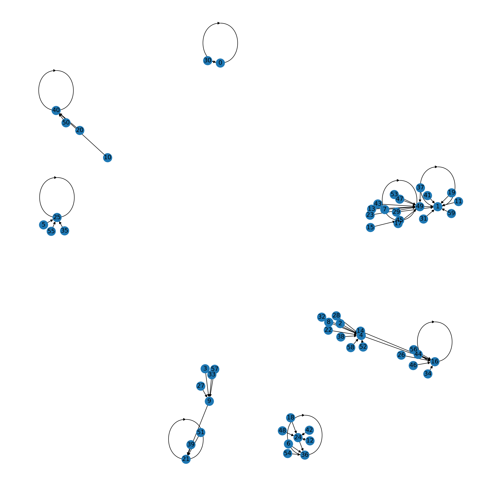
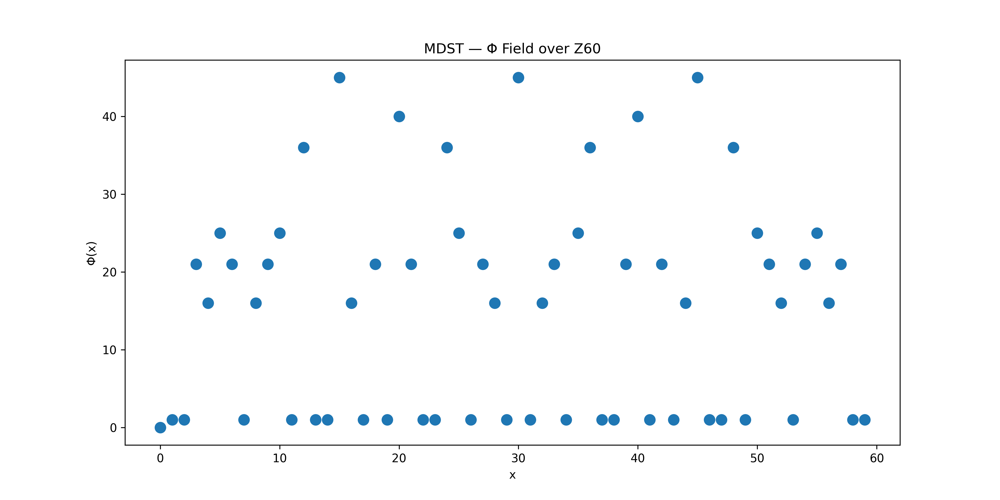
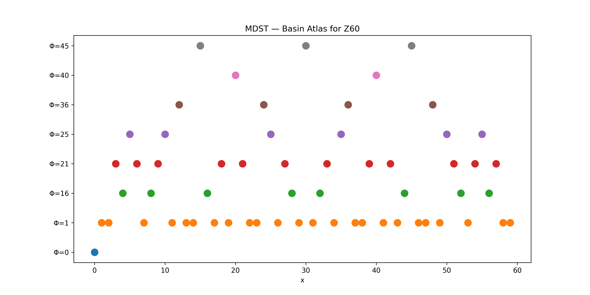
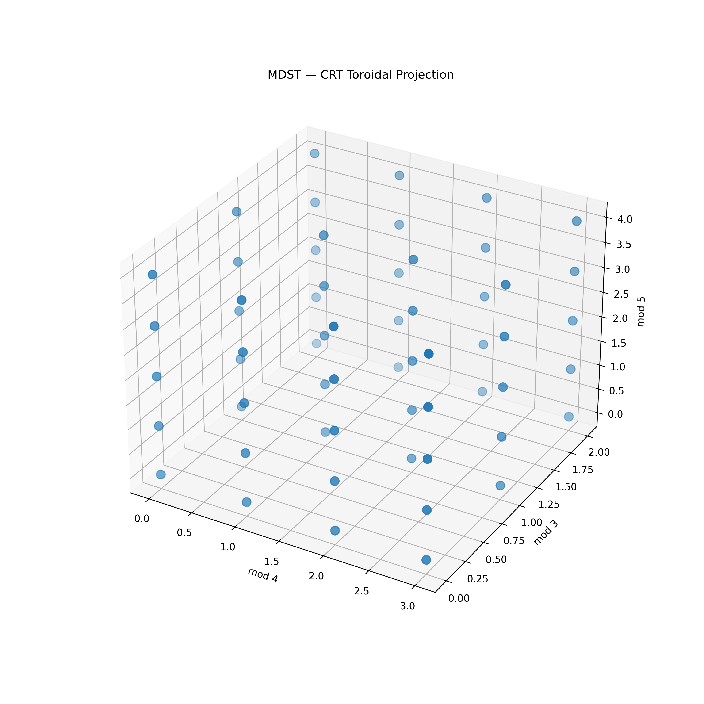

# MDST — Modular Dynamical Systems Toolkit

## A CRT-Based Computational Framework for Finite Ring Dynamics

---

## Abstract

We introduce **MDST (Modular Dynamical Systems Toolkit)**, a computational and theoretical framework for analyzing discrete dynamical systems defined over finite rings (\mathbb{Z}_n). The system is based on a structural decomposition via the **Chinese Remainder Theorem (CRT)**, enabling a fully factorized representation of state space into independent modular components.

We define a class of dynamical maps of the form:
[
f_k(x) = x^k \bmod n
]
and introduce a canonical classification operator (\Phi), which assigns each state to its asymptotic idempotent attractor without requiring iterative simulation.

MDST replaces traditional stepwise iteration with a **direct algebraic projection onto dynamical basins**, revealing a hidden toroidal geometry underlying modular exponentiation. The framework is fully deterministic, cache-local, and parallelizable.

We also present the **Yupana CRT model** (as a separate implementation project), which serves as a computational instantiation of this theory.

---

## 1. Introduction

Classical dynamical systems over finite sets are typically studied through iterative application of a function until convergence or cycle detection. This approach is computationally expensive and obscures global structure.

MDST proposes a different perspective:

> The dynamics of (f_k(x) = x^k \bmod n) are not temporal sequences, but **algebraic partitions of a finite phase space**.

Using the CRT decomposition:
[
\mathbb{Z}*n \cong \prod*{i=1}^{r} \mathbb{Z}_{p_i^{\alpha_i}}
]

we obtain a fully factorized representation of the system where each component evolves independently.

---

## 2. Core Construction

### 2.1 State Space

[
\mathcal{X}*n = \mathbb{Z}*n
\quad \cong \quad
\mathbb{Z}*{p_1^{\alpha_1}} \times \cdots \times \mathbb{Z}*{p_r^{\alpha_r}}
]

Each state is represented as:
[
x \longleftrightarrow (x_1, x_2, \dots, x_r)
]

---

### 2.2 Dynamical Map

We define:
[
f_k(x) = x^k \bmod n
]

which decomposes into:
[
f_k(x_1, \dots, x_r) =
(x_1^k, \dots, x_r^k)
]

All operations are local to each modulus component.

---

### 2.3 CRT Decoupling Principle

The system satisfies:

> Global dynamics = product of independent local dynamics

There is no cross-component coupling.

---

## 3. The Φ Classification Operator

We define a non-iterative attractor classifier:

[
\Phi: \mathbb{Z}_n \to E_n
]

where (E_n) is the set of idempotent elements.

### Definition:

[
\Phi(x_1,\dots,x_r) =
\operatorname{CRT}(\phi_1(x_1), \dots, \phi_r(x_r))
]

with:

* (\phi_i(x_i) = 0) if divisible by (p_i)
* (\phi_i(x_i) = 1) otherwise

---

### Key Property

[
\Phi(x) = \text{asymptotic attractor of } x \text{ under } f_k
]

without iteration.

---

## 4. Geometric Interpretation

MDST induces a discrete geometry:

### 4.1 CRT Torus

[
\mathbb{Z}*n \cong \prod \mathbb{Z}*{p_i^{\alpha_i}}
]

→ discrete torus topology

---

### 4.2 Basin Structure

The state space is partitioned into:

[
\Phi^{-1}(e)
]

Each basin corresponds to a dynamical attractor.

---

### 4.3 Functional Graph

The system defines a directed graph:

* nodes: elements of (\mathbb{Z}_n)
* edges: (x \to f_k(x))

This graph decomposes into:

* fixed points
* cycles
* transient trees

---

## 5. Computational Model

MDST replaces iterative computation with:

### 5.1 Table-driven evaluation

For each component:
[
T_i[a] = a^k \bmod p_i^{\alpha_i}
]

---

### 5.2 Complexity reduction

| Method    | Complexity     |
| --------- | -------------- |
| Iteration | (O(t \cdot n)) |
| MDST      | (O(r)) lookup  |

---

### 5.3 Parallel structure

Each CRT component is independent:

* no carries
* no synchronization
* fully parallelizable

---

## 6. Experimental Case: ( \mathbb{Z}_{60} )

[
60 = 2^2 \cdot 3 \cdot 5
]

Decomposition:
[
\mathbb{Z}_4 \times \mathbb{Z}_3 \times \mathbb{Z}_5
]

### Observations

* 8 attractor classes
* non-uniform basin sizes
* maximum dynamic depth = 2
* full convergence without iteration via Φ

---

## 7. Visual Atlas

MDST is naturally represented through four coupled layers:

* Functional graph (global dynamics)
* Φ field (classification space)
* Basin atlas (attractor partition)
* CRT torus (internal structure)

All layers are algebraically equivalent.

---

## 8. Relationship to Yupana CRT

MDST defines the theoretical framework.

The **Yupana CRT project** (separate repository) implements:

* table-driven execution engine
* hardware-inspired modular computation
* spatial CRT visualization system

> MDST = theory
> Yupana CRT = computational realization

---

## 9. Properties

* Deterministic
* Finite-state complete
* Fully decomposable
* Cache-local
* Parallelizable
* Non-iterative classification possible

---

## 10. Future Work

* FPGA implementation of CRT torus execution
* extension to polynomial dynamics
* categorical formulation of Φ
* spectral analysis of functional graphs
* embedding into neural discrete systems

---

## 11. Repository Structure

```
MDST/
├── Core/              # CRT engine and algebraic primitives
├── Z60/               # Canonical experiments
├── Z216/              # Extended systems
├── Observers/        # Analysis tools
├── Experiments/      # Simulation scripts
├── Theory/           # Formal definitions
├── Specs/            # Mathematical specifications
├── docs/
│   └── atlas/        # Visual geometric representations
└── examples/         # Minimal demonstrations
```

---

## 12. License

This project is released under a **dual license model**:

* Academic / Research use: permissive open license
* Commercial / industrial use: separate proprietary license required

(See LICENSE file for details)

---

## 13. Conclusion

MDST reframes modular exponent dynamics not as iterative processes, but as **algebraic geometry over finite rings**.

The key insight is:

> Dynamics over (\mathbb{Z}_n) are not time evolution, but space partitioning.

---

## Visual Atlas

### Functional Graph



---

### Φ Field



---

### Basin Atlas



---

### CRT Torus Projection

